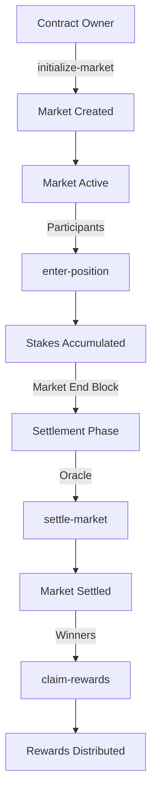

# PredictaVault: Advanced Decentralized Prediction Market Infrastructure

A next-generation prediction market protocol engineered for the Stacks ecosystem, enabling sophisticated forecasting mechanisms with institutional-grade security. PredictaVault transforms market sentiment into quantifiable predictions through cryptographically secured smart contracts and oracle-driven price feeds.

## 🏗️ System Overview

PredictaVault is a decentralized prediction market platform that allows users to stake STX tokens on price predictions for various assets. The protocol operates on a binary prediction model where participants can take either bullish ("up") or bearish ("down") positions on future price movements.

### Key Features

- **Decentralized Market Resolution**: Oracle-driven price settlement with Byzantine fault tolerance
- **Stake-Weighted Participation**: Anti-sybil mechanisms through minimum stake requirements
- **Dynamic Fee Optimization**: Sustainable protocol economics with configurable fee structures
- **Proportional Reward Distribution**: Winners receive rewards proportional to their stake and market performance
- **Multi-Layer Security**: Administrative controls with multi-signature capabilities

## 🔧 Contract Architecture

### Core Components

#### 1. **Market Registry**

- Stores market metadata including initial/final prices, stake pools, and settlement status
- Tracks market lifecycle from creation to settlement
- Manages bullish and bearish stake pools separately

#### 2. **Participant Registry**

- Records individual participant positions and stakes
- Tracks sentiment predictions ("up" or "down")
- Manages reward claim status to prevent double-claiming

#### 3. **Administrative System**

- Owner-controlled market creation and configuration
- Oracle authority management for price settlement
- Treasury management for protocol sustainability

### Data Structures

```clarity
;; Market Data
{
  initial-price: uint,
  final-price: uint,
  bullish-stake-pool: uint,
  bearish-stake-pool: uint,
  market-start-height: uint,
  market-end-height: uint,
  settlement-completed: bool
}

;; Participant Position
{
  market-sentiment: (string-ascii 4), ;; "up" or "down"
  stake-amount: uint,
  rewards-claimed: bool
}
```

## 🔄 Data Flow

### Market Lifecycle



### Position Entry Flow

1. **Market Validation**: Check if market exists and is active
2. **Parameter Validation**: Verify sentiment type and stake amount
3. **Stake Transfer**: Move STX from participant to contract
4. **Position Recording**: Store participant's position data
5. **Pool Updates**: Update respective bullish/bearish stake pools

### Settlement & Rewards Flow

1. **Oracle Settlement**: Authorized oracle sets final price
2. **Winner Determination**: Compare final price vs initial price
3. **Reward Calculation**: Proportional distribution based on stake ratio
4. **Fee Deduction**: Protocol sustainability fee (default 2%)
5. **Reward Distribution**: Transfer net rewards to winners

## 🔐 Security Framework

### Access Control

- **Contract Owner**: Market creation, configuration updates, treasury management
- **Oracle Authority**: Price settlement and market resolution
- **Participants**: Position entry and reward claiming

### Anti-Sybil Mechanisms

- Minimum stake requirements (default: 1 STX)
- Stake-based participation prevents low-cost attacks
- Economic incentive alignment for honest participation

### Error Handling

- Comprehensive error codes for all failure scenarios
- Input validation on all public functions
- State consistency checks before state modifications

## 📋 API Reference

### Public Functions

#### Market Operations

- `initialize-market(initial-price, start-height, end-height)` - Create new prediction market
- `enter-position(market-id, sentiment, stake-amount)` - Enter position in active market
- `settle-market(market-id, final-price)` - Settle market with final price (Oracle only)
- `claim-rewards(market-id)` - Claim rewards for winning positions

#### Administrative Functions

- `update-oracle-authority(new-oracle)` - Change oracle authority
- `update-minimum-stake(new-minimum)` - Adjust minimum stake requirement
- `update-protocol-fee(new-fee-rate)` - Modify protocol fee rate
- `withdraw-treasury-funds(withdrawal-amount)` - Withdraw protocol earnings

### Read-Only Functions

- `get-market-info(market-id)` - Retrieve market data
- `get-participant-position(market-id, participant)` - Get participant position
- `get-treasury-balance()` - Check contract treasury balance

## 🚀 Usage Examples

### Creating a Market

```clarity
;; Create Bitcoin price prediction market
(contract-call? .predictavault initialize-market 
  u50000000000 ;; Initial price: 50,000 STX (in microSTX)
  u1000        ;; Start at block 1000
  u2000        ;; End at block 2000
)
```

### Entering a Position

```clarity
;; Bet 5 STX that price will go up
(contract-call? .predictavault enter-position 
  u1           ;; Market ID
  "up"         ;; Bullish sentiment
  u5000000     ;; 5 STX stake
)
```

### Claiming Rewards

```clarity
;; Claim rewards for winning prediction
(contract-call? .predictavault claim-rewards u1)
```

## 🎯 Economic Model

### Reward Distribution

Winners receive rewards proportional to their stake relative to the total winning pool:

```
Gross Rewards = (Participant Stake × Total Market Stake) ÷ Winning Pool Stake
Protocol Fee = Gross Rewards × Fee Rate (default 2%)
Net Rewards = Gross Rewards - Protocol Fee
```

### Fee Structure

- **Protocol Fee**: 2% of gross rewards (configurable)
- **Minimum Stake**: 1 STX (configurable)
- **Gas Costs**: Standard Stacks transaction fees

## 🛠️ Configuration

### Default Parameters

- **Minimum Stake**: 1,000,000 microSTX (1 STX)
- **Protocol Fee**: 2%
- **Oracle Authority**: ST1PQHQKV0RJXZFY1DGX8MNSNYVE3VGZJSRTPGZGM

### Error Codes

- `u100`: Unauthorized access
- `u101`: Market not found
- `u102`: Invalid prediction type
- `u103`: Market unavailable
- `u104`: Reward already claimed
- `u105`: Insufficient funds
- `u106`: Invalid parameters

## 🔮 Future Enhancements

- Multi-asset prediction markets
- Advanced oracle aggregation
- Governance token integration
- Cross-chain market bridging
- Automated market maker integration

## 📄 License

This smart contract is provided as-is for educational and development purposes. Ensure proper auditing before mainnet deployment.

## 🤝 Contributing

Contributions are welcome! Please ensure all changes include comprehensive tests and maintain the existing security standards.
